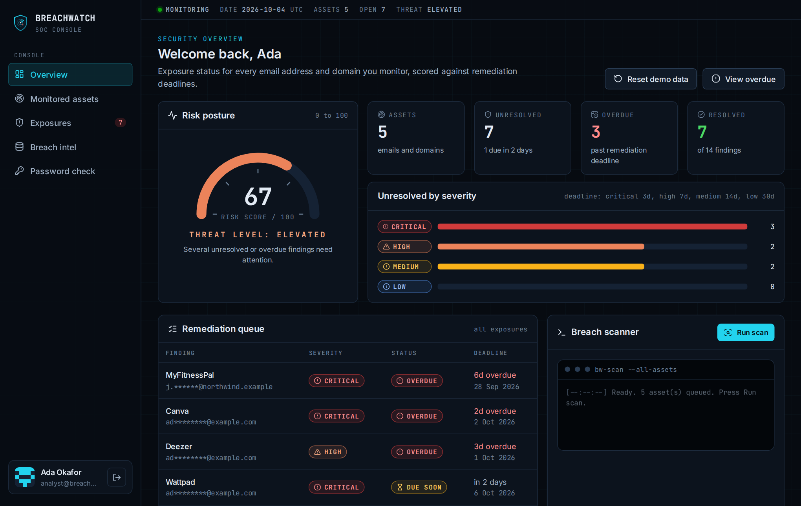

# BreachWatch

A data breach monitor for email addresses and company domains. Add the identities you care about, scan them against a leak index, and work each exposure to resolution before its deadline. Built as a 300-level university project.

**Live:** https://breachwatch-production.up.railway.app
**Demo login:** `analyst@breachwatch.dev` / `Demo1234!` (pre-filled on the sign-in page)
**Full documentation:** [docs/BreachWatch-Documentation.pdf](docs/BreachWatch-Documentation.pdf)



## Features

- **Monitored assets.** Watch single email addresses or a whole domain (every leaked address at that domain).
- **Scans.** Each scan matches assets against a leak index that stores only SHA-256 hashes and masked addresses, and records new exposures. Scans are idempotent.
- **Severity and deadlines.** Severity comes from the most dangerous data type in the breach (passwords and financial data are critical). Each exposure must be resolved within 3, 7, 14 or 30 days. Status is open, due soon, overdue or resolved.
- **Risk score.** A 0 to 100 score from unresolved findings (overdue ones count 1.5 times), mapped to LOW, GUARDED, ELEVATED or SEVERE.
- **Response checklist.** Steps generated from the leaked data types (change password, enable MFA, contact the bank, credit freeze...), notes, resolve and reopen.
- **Breach intel.** A searchable catalog of 885 verified public breaches from the [Have I Been Pwned](https://haveibeenpwned.com/API/v3) breach list (CC BY 4.0).
- **Password check.** Live check against Pwned Passwords using k-anonymity: only the first 5 characters of the SHA-1 hash are sent.
- **Demo reset.** The demo account has a Reset demo data button that restores its starting state, dated relative to today.
- **Security basics.** bcrypt password hashes, signed JWT in an HTTP-only cookie, every query scoped to the signed-in user, security headers, health check that pings the database.

The breach catalog and the password check use real data. The per-email leak index is demo data, because the real per-address lookup needs a paid key. Set `HIBP_API_KEY` to add live lookups to scans.

## Tech stack

Next.js 16 (App Router, Server Components, Server Actions), TypeScript (strict), Drizzle ORM and drizzle-kit migrations, PostgreSQL, Zod, bcryptjs, jose, lucide-react, DiceBear, Fontsource, Vitest, Playwright, Railway.

## Quick start

Requires Node.js 22 and PostgreSQL.

```bash
service postgresql start
sudo -u postgres createdb breachwatch
sudo -u postgres createdb breachwatch_test

cp .env.example .env      # set DATABASE_URL and SESSION_SECRET
npm install
npm run db:migrate
npm run db:seed           # resets the database and loads demo data
npm run dev               # http://localhost:3000
```

Set `BREACHWATCH_TODAY=YYYY-MM-DD` to pin the date used by every business rule. The seed is dated relative to that day.

## Scripts

| Script | What it does |
| --- | --- |
| `npm run dev` | Development server |
| `npm run build` / `npm start` | Production build and server |
| `npm run start:prod` | Migrate, seed only if the database is empty, start (used on Railway) |
| `npm run db:generate` | Generate a new SQL migration from `src/db/schema.ts` |
| `npm run db:migrate` | Apply migrations in `drizzle/` |
| `npm run db:seed` | Reset the database and load demo data (`-- --if-empty` to skip when data exists) |
| `npm run breaches:sync` | Refresh `data/breaches.json` from the public HIBP breach list |
| `npm test` | Unit and integration tests (Vitest, needs the `breachwatch_test` database) |
| `npm run test:e2e` | Playwright tests on desktop and mobile (builds and starts the app on port 3100) |
| `npm run docs:pdf` | Rebuild the documentation PDF with fresh screenshots (run `npm run build` first) |
| `npm run typecheck` / `npm run lint` | TypeScript and ESLint |

## Tests

| Suite | Count |
| --- | --- |
| Unit (Vitest) | 47 |
| Integration against real Postgres (Vitest) | 17 |
| End to end, desktop (Playwright) | 14 |
| End to end, mobile Pixel 7 (Playwright) | 1 |

## Project layout

| Path | Contents |
| --- | --- |
| `src/lib/` | Pure business rules that take "today" as an argument: severity, deadlines, status, risk score, remediation steps, password helpers, validation |
| `src/server/` | Database access: user-scoped queries, scan engine, catalog loader, seed, session |
| `src/app/` | Routes and Server Actions |
| `src/components/` | UI components (gauge, badges, scan console) |
| `src/proxy.ts` | Redirects signed-out visitors (Next.js 16 replaces middleware with proxy) |
| `drizzle/` | Versioned SQL migrations |
| `data/breaches.json` | Snapshot of the public breach catalog |
| `tests/` | Unit, integration and e2e tests |
| `docs/` | Documentation PDF and the scripts that build it |

## Deployment

Deployed on Railway (project `school-projects`, service `breachwatch`, database `breachwatch-postgres`). See `railway.json`: build with `npm run build`, start with `npm run start:prod`, health check at `/api/health`. Variables: `DATABASE_URL=${{breachwatch-postgres.DATABASE_URL}}`, `SESSION_SECRET`, `NODE_ENV=production`.

Redeploys keep existing data: the seed only runs when the database is empty. To put the demo account back to its starting state before a presentation, sign in as the demo user and press **Reset demo data** on the dashboard. It rebuilds that account's assets and findings relative to today and does not touch other accounts.

## Credits

Breach data from [Have I Been Pwned](https://haveibeenpwned.com/) by Troy Hunt, licensed CC BY 4.0. Password checks use the [Pwned Passwords](https://haveibeenpwned.com/Passwords) range API.
